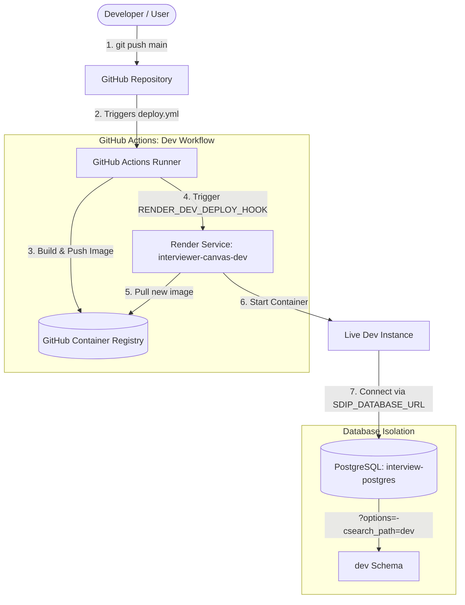
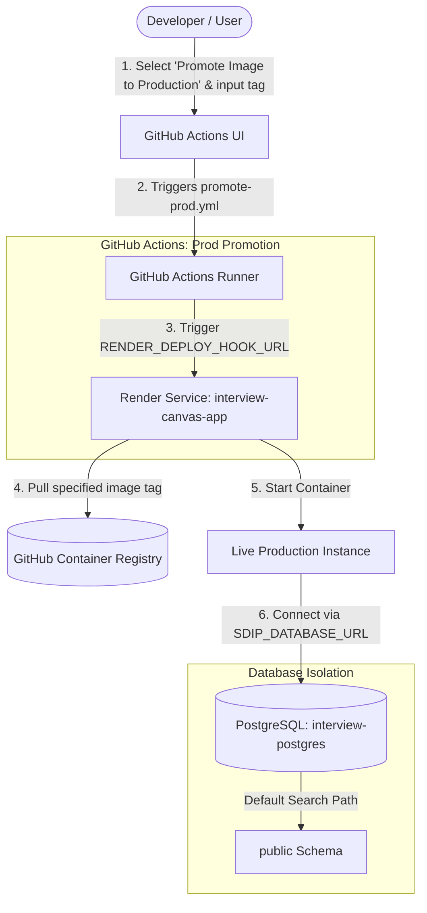

# 🎨 System Design Interview Platform 🚀

A browser-based collaborative workspace for conducting live system-design interviews. An interviewer creates a session and shares a link; candidates and other interviewers join and work together on the same infinite canvas in real time — placing architecture components, connecting them with arrows, adding labels and notes, and drawing freehand. Edits are broadcast over WebSockets so every participant sees updates immediately, and the final canvas is preserved for later review.

---

## 🌐 Live Application & Production Endpoints

The application is deployed across multi-environment web services hosted on **Render**:

* 🖥️ **Production Web App:** [https://interviewer-canvas-app.onrender.com](https://interviewer-canvas-app.onrender.com)
* 📚 **Production API / Swagger Docs:** [https://interviewer-canvas-app.onrender.com/docs](https://interviewer-canvas-app.onrender.com/docs)
* 🧪 **Dev Web App:** [https://interviewer-canvas-dev.onrender.com](https://interviewer-canvas-dev.onrender.com)
* 📚 **Dev API / Swagger Docs:** [https://interviewer-canvas-dev.onrender.com/docs](https://interviewer-canvas-dev.onrender.com/docs)

> **Note:** Running on free Render instances, the services may spin down after periods of inactivity. Initial requests may take ~30–50 seconds to wake up an instance.

---

## 💡 Acknowledgments & Context

* 🎨 **Frontend & OpenAPI Spec:** The frontend application and the `openapi.yaml` specification in this repository are based on [Alexey Grigorev's interview-canvas-share repository](https://github.com/alexeygrigorev/interview-canvas-share/tree/main/frontend). The frontend UI was initially generated using Lovable and adopted here to avoid token consumption costs during generation. Special thanks to Alexey Grigorev for sharing the base UI and API contract.
* 🎓 **Course & AI Assistance:** Built as part of hands-on practice to reinforce and review training course material. Development was assisted using **Gemini** and **ChatGPT** for complex code generation tasks. **Cline with Ollama** was utilized for project planning and managing smaller sub-tasks, with every generated change carefully reviewed and validated manually.

---

## 🛠️ Development Strategy & Agentic AI Workflow

This project serves as a step-by-step blueprint for rapidly prototyping and building production-ready applications using AI agents:

1. 🎨 **Frontend Setup & Contract:**
   - Generated the initial frontend UI using Lovable.
   - Established the strict OpenAPI specification contract (`openapi.yaml`).

2. 🧪 **Frontend Mock Verification:**
   - Validated the frontend interface against a mock backend server to guarantee complete API contract compliance before implementing backend logic.

3. ⚙️ **Iterative Backend Development:**
   - **Phase 1 (In-Memory):** Built core FastAPI REST endpoints and WebSocket broadcast infrastructure using in-memory data structures for rapid prototyping.
   - **Phase 2 (SQLite & SQLAlchemy):** Integrated SQLAlchemy ORM for relational persistence using SQLite.
   - **Phase 3 (PostgreSQL Migration):** Upgraded database architecture to production-grade PostgreSQL with explicit connection pooling and health checks.

4. 🐳 **Containerization & Orchestration:**
   - Authored a multi-stage `Dockerfile` to compile static assets and serve the unified application via FastAPI/Uvicorn.
   - Configured `docker-compose.yml` to orchestrate PostgreSQL and application container dependency graphs.

5. 🎭 **E2E Testing Automation:**
   - Developed automated Playwright test suites (`test-e2e/`) to continuously verify live UI-to-backend integration and WebSocket synchronization.

6. 🚢 **Automated Dev CI/CD Pipeline:**
   - Formulated an automated GitHub Actions workflow (`.github/workflows/deploy.yml`) triggered on every push to `main`:
     - 🧪 **Automated Testing:** Runs backend unit and integration tests using `pytest`.
     - 📦 **Container Registry Publishing:** Builds a Docker container image and publishes it to **GitHub Container Registry (GHCR)** with `latest` and immutable `YYYY-MM-DD-SHA` tags.
     - ⚡ **Automated Dev Deployment:** Triggers `RENDER_DEV_DEPLOY_HOOK` to update the `interviewer-canvas-dev` service seamlessly.

7. 🛡️ **Manual Production Promotion & Environment Isolation:**
   - Established a controlled promotion workflow (`.github/workflows/promote-prod.yml`) allowing manual image promotion to Production after Dev verification.
   - Implemented database schema isolation on a single PostgreSQL instance (`dev` vs. `public` schema) to maintain data separation within free tier resource limits.

---


## 🚀 Deployment & Environments Architecture

This project uses a multi-environment CI/CD pipeline hosted on **Render** and backed by **GitHub Container Registry (GHCR)** for immutable Docker image storage.

### Database Isolation Strategy

To fit within Render's single active free-tier database limit, both environments share one PostgreSQL instance (`interview-postgres`). Data isolation is handled using separate PostgreSQL schemas:

* **Production Environment:** Uses the `public` schema (`SDIP_DATABASE_URL`).
* **Dev Environment:** Uses the `dev` schema (`SDIP_DATABASE_URL` with `?options=-csearch_path=dev` appended).

All Dev queries, writes, and migrations run strictly inside the `dev` schema, keeping production data completely untouched.

---

### Environment Breakdown

| Environment | Web Service Name | Database Instance | Schema Isolation | Trigger Strategy |
| :--- | :--- | :--- | :--- | :--- |
| **Dev** | `interviewer-canvas-dev` | `interview-postgres` | `dev` (`?options=-csearch_path=dev`) | **Automated:** Pushes to `main` build `ghcr.io/<owner>/<repo>:<YYYY-MM-DD-SHA>` and deploy to Dev. |
| **Production** | `interview-canvas-app` | `interview-postgres` | `public` (default) | **Manual:** Triggered via `Promote Image to Production` workflow in GitHub Actions. |

---

### Deployment Pipeline Procedures

#### 1. Automated Dev Deployment (Git Push)


#### 2. Manual Production Promotion (Workflow Dispatch)



## 💻 Local Setup & Quick Start

Follow these simple steps to get the application up and running locally.

### 📋 Prerequisites

* **Operating System:** Ubuntu / Linux (or WSL2 on Windows).
* **Docker & Docker Compose:** Installed and running.
* **Node.js & npm:** (Optional, only needed if modifying the frontend directly).
* **Python 3.12 & Poetry:** (Optional, only needed if developing backend code outside Docker).

---

### 🚀 Running the Project Locally

```sh
# Step 1: Clone the Repository
git clone [https://github.com/SabaYahyaa/interview-canvas-share-training-dev-tools-zoomcamp.git](https://github.com/SabaYahyaa/interview-canvas-share-training-dev-tools-zoomcamp.git)
cd interview-canvas-share-training-dev-tools-zoomcamp

# Step 2: Choose One of the Two Ways to Run the App Locally:

# --- Way 1: One-Command Stack Execution (Recommended) ---
# Builds and launches the PostgreSQL database and application container together:
docker compose up --build

# --- Way 2: Granular Database & Web Container Execution ---
# Alternatively, start the database first and build/run the application container manually:
# 1. Start the PostgreSQL database service in detached mode:
docker compose up -d db

# 2. Build the web application Docker image:
docker build -t interviewer-canvas-app .

# 3. Run the web container attached to the Docker Compose network:
docker run -p 8000:8000 \
  --network interview-canvas-share-training-dev-tools-zoomcamp_default \
  -e DATABASE_URL="postgresql://postgres:postgres@db:5432/interviewer_db" \
  interviewer-canvas-app


# Step 3: Access Endpoints
# Frontend Web App: http://localhost:8000
# Backend API Docs (Swagger): http://localhost:8000/docs


```

### 🧪 Steps for Automated End-to-End Testing Locally

```sh
# Step 1: Stop any currently running Docker containers and volumes
docker compose down -v

# Step 2: Run the automated E2E tests via Makefile
# Spins up the stack, waits for database healthchecks, and executes Playwright tests
make run-e2e